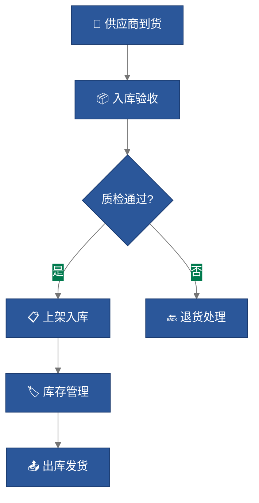

# 图片生成器 Skill

## 触发方式

用户说"生成图片"、"做个图表"、"画个流程图"、"做个架构图"、"生成插图"等。

---

## 四大生成模式

### 模式 1：数据图表（matplotlib → PNG）

**适用场景**：柱状图、折线图、饼图、雷达图、散点图、热力图等运营数据可视化。

**工作流**：
1. 确认数据 → 确认图表类型 → 确认配色/尺寸
2. 安装依赖（如缺失）：`pip install matplotlib numpy`
3. 编写 Python 脚本，输出为高清 PNG（300 DPI）
4. 保存到用户指定目录，返回文件路径

**PPT 优化默认设定**：
- 尺寸：1920×1080（16:9 宽屏适配）
- DPI：300（支持放大不失真）
- 配色：默认商务蓝 `#2B579A` + 中移绿 `#007A4D` + 灰 `#757575`
- 字体：`SimHei`（黑体，中文支持）
- 关闭顶部和右侧边框线，保持简洁
- 自动添加数据标签

**示例代码模板**：
```python
import matplotlib.pyplot as plt
import matplotlib.font_manager as fm
import numpy as np

# 中文字体
plt.rcParams['font.sans-serif'] = ['SimHei', 'Microsoft YaHei']
plt.rcParams['axes.unicode_minus'] = False

# 数据
categories = ['1月', '2月', '3月', '4月', '5月', '6月']
values = [1200, 1350, 1100, 1500, 1400, 1600]

# 16:9 画布
fig, ax = plt.subplots(figsize=(16, 9), dpi=300)

# 柱状图
bars = ax.bar(categories, values, color='#2B579A', width=0.6, edgecolor='white', linewidth=0.5)

# 数据标签
for bar, val in zip(bars, values):
    ax.text(bar.get_x() + bar.get_width()/2, bar.get_height() + 15,
            str(val), ha='center', va='bottom', fontsize=14, fontweight='bold')

# 样式
ax.spines['top'].set_visible(False)
ax.spines['right'].set_visible(False)
ax.set_title('月度入库量趋势', fontsize=24, fontweight='bold', pad=20)
ax.tick_params(labelsize=12)

plt.tight_layout()
plt.savefig('output/chart.png', dpi=300, bbox_inches='tight', facecolor='white')
plt.close()
```

---

### 模式 2：流程图 / 架构图（Mermaid → SVG/PNG）

**适用场景**：仓储布局图、操作流程图、组织架构图、物流链路图。

**工作流**：
1. 确认节点和关系 → 选择图表类型（flowchart/graph/sequence） → 生成 Mermaid 代码
2. 优先输出 `.mmd` 源文件 + 内联 SVG
3. 若需要 PNG，用 `mmdc`（mermaid-cli）或在线服务转换

**支持的 Mermaid 图表类型**：
| 类型 | 关键字 | 典型用途 |
|------|--------|----------|
| 流程图 | `flowchart TD/LR` | 操作流程、决策树 |
| 时序图 | `sequenceDiagram` | 系统交互、API 流程 |
| 甘特图 | `gantt` | 项目排期 |
| 状态图 | `stateDiagram-v2` | 订单状态流转 |
| 类图 | `classDiagram` | 数据模型 |

**PPT 配色 Mermaid 模板**：


---

### 模式 3：AI 创意图片（DALL-E API / 本地替代）

**适用场景**：PPT 封面背景、章节分隔页、创意配图、概念插图。

**工作流**：
1. 确认画面描述 → 生成 Prompt → 调用 API
2. 优先方案：DALL-E 3（需用户提供 OpenAI API Key）
3. 离线替代：用 SVG 生成抽象几何图形作为封面/分隔页背景

**DALL-E 调用示例**（需用户提供 key）：
```bash
curl https://api.openai.com/v1/images/generations \
  -H "Content-Type: application/json" \
  -H "Authorization: Bearer $OPENAI_API_KEY" \
  -d '{
    "model": "dall-e-3",
    "prompt": "Modern logistics warehouse with automated conveyor systems, clean professional style, corporate presentation background, blue and green color scheme",
    "n": 1,
    "size": "1792x1024",
    "quality": "hd"
  }' -o output/cover_image.png
```

**离线 SVG 抽象背景模板**（无需 API）：
- 渐变几何图形封面
- 数据流线条装饰
- 网格/点阵背景

---

### 模式 4：SVG 矢量图标 / 插图

**适用场景**：PPT 装饰元素、自定义图标、信息图、KPI 卡片。

**工作流**：
1. 确认图标需求 → 直接生成 SVG 代码 → 保存 `.svg` 文件
2. SVG 可无损放大、可改色、可直接嵌入 PPT

**常用图标 SVG 模板库**：
- 📦 仓库/库存图标
- 🚚 运输/配送图标
- 📊 数据/报表图标
- ✅ 完成/通过图标
- ⚠️ 警示/注意图标
- 👤 人员/团队图标

---

## 输出规范

| 类型 | 格式 | 尺寸 | 保存路径 |
|------|------|------|----------|
| 数据图表 | PNG | 1920×1080 | `output/charts/` |
| 流程图 | SVG + MMD | 自适应 | `output/diagrams/` |
| AI 图片 | PNG | 1792×1024 | `output/images/` |
| SVG 图标 | SVG | 按需 | `output/icons/` |

---

## 交互协议

1. **模式识别**：根据用户描述自动判断需要哪种生成模式
2. **参数确认**：关键参数（数据、尺寸、配色）在生成前向用户确认
3. **批量生成**：支持一次生成多张图片（如同一报告的多个图表）
4. **文件返回**：生成后返回文件路径，供后续 PPT 制作使用

---

## 依赖检查清单

| 依赖 | 用途 | 安装命令 |
|------|------|----------|
| matplotlib | 数据图表 | `pip install matplotlib numpy` |
| Pillow | 图像处理 | `pip install Pillow`（已安装） |
| mermaid-cli | 流程图转 PNG | `npm install -g @mermaid-js/mermaid-cli` |
| OpenAI API Key | DALL-E 图片 | 用户提供环境变量 `OPENAI_API_KEY` |

---

## 记忆

此 skill 支持积累用户偏好：
- 配色方案偏好
- 常用图表类型
- 字体选择
- 输出尺寸要求

参见 `.claude/agent-memory/image-generator/` 目录。
